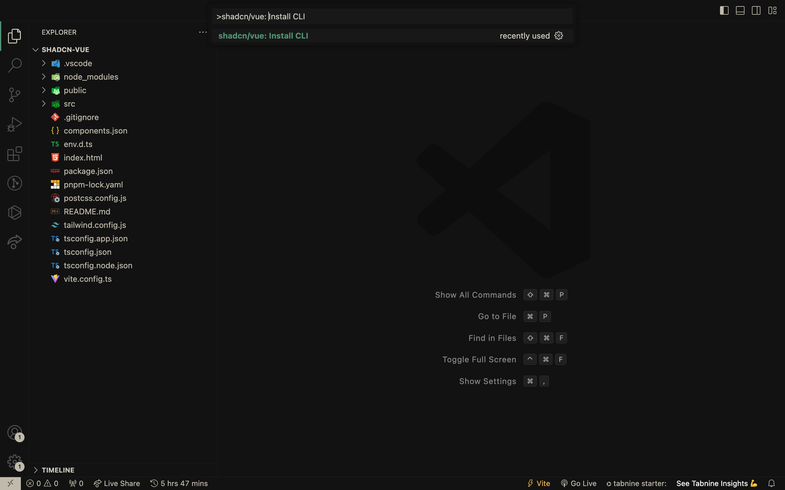
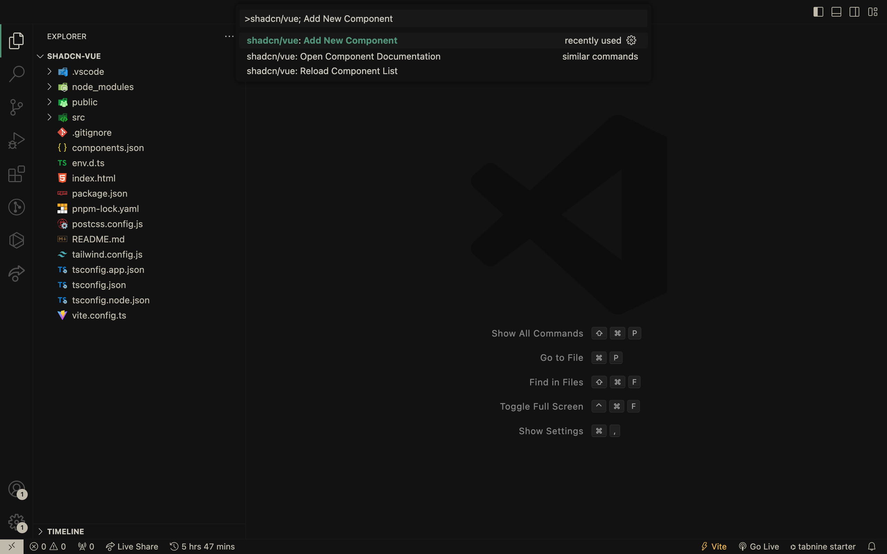
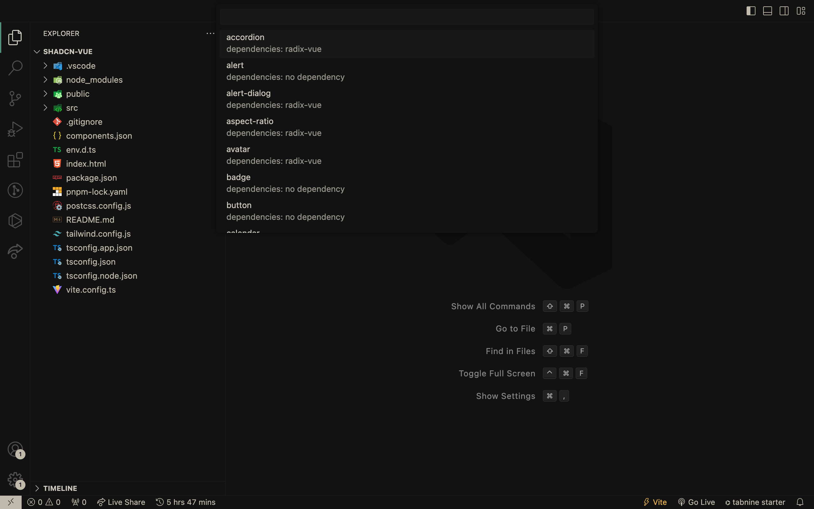
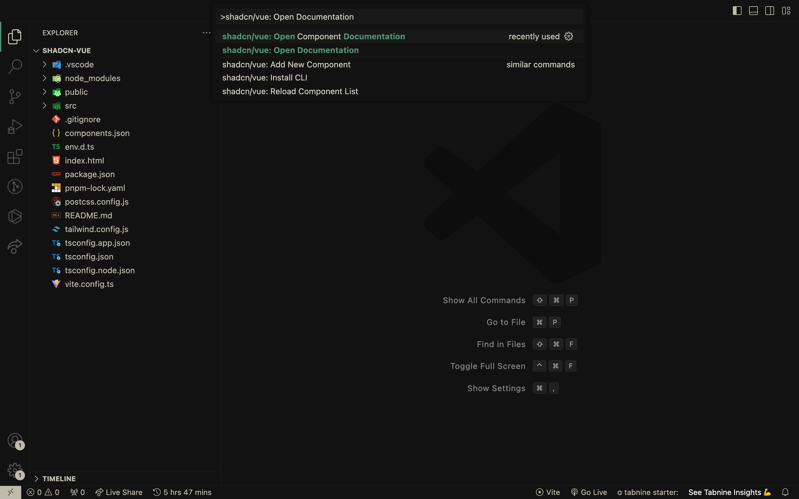
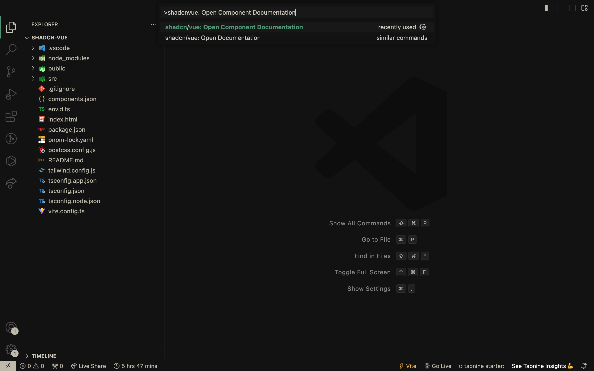
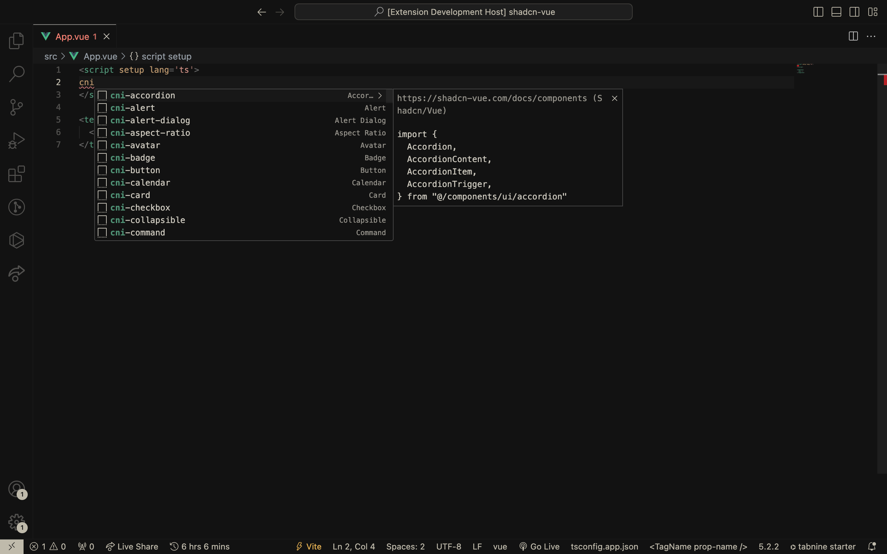

# Shadcn/Vue

This will help install the [shadcn/vue](https://shadcn-vue.com) components directly from VS Code

## Initialize the Shadcn/Vue CLI



## Install components




## Choose a component to install from the list




## Open the Shadcn-Vue documentation




## Navigate to a particular component's documentation page




## Shadcn/Vue Snippets

Easily import and use shadcn-vue components with ease using snippets within VSCode. Just type `cn` or `shadcn` in your vue file and choose from an array of components to use.




### How it works

| Snippet           | Description                            |
| ----------------- | -------------------------------------- |
| `cn-help`         | How to use shadcn/vue snippets         |
| `cni-[component]` | Adds imports for the component         |
| `cnx-[component]` | Adds the template for the vue component|

### How to use?

1. Components

For `Alert` component, type `cni-alert` to add imports in your vue file, and to use the component, use `cnx-alert`.

> Similarly, for any other component, use `cni-[component]` to add imports and `cnx-[component]` to use.

```tsx
// cni-alert
import { Alert, AlertDescription, AlertTitle } from "@/components/ui/alert"

// cnx-alert
<Alert>
  <AlertTitle>Heads up!</AlertTitle>
  <AlertDescription>
    You can add components using the Shadcn/Vue VSCode extension.
  </AlertDescription>
</Alert>;
```

### How to contribute?

Use this link - [Snippet Generation](https://snippet-generator.app/?description=https://shadcn-vue.com/docs/components&tabtrigger=shadcn-&snippet=%22https://shadcn-vue.com/docs/components%22:+%7B%0A++%22prefix%22:+%22shadcn-%22,%0A++%22body%22:+%5B%0A++%5D,%0A++%22description%22:+%22https://shadcn-vue.com/docs/components%22%0A%7D&mode=vscode) to generate snippets and add/update them to the `snippets` folder that is located in the `src` accordingly.
